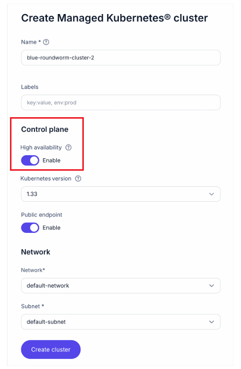

[etcd-glossary]: https://docs.nebius.com/kubernetes/components#etcd
[create-clusters-web-console]: https://docs.nebius.com/kubernetes/clusters/manage#web-console
[create-clusters-cli]: https://docs.nebius.com/kubernetes/clusters/manage#cli
[create-clusters-terraform]: https://docs.nebius.com/kubernetes/clusters/manage#terraform

# High availability in Managed Service for Kubernetes® clusters

High availability means that your Kubernetes cluster continues to function even if parts of the infrastructure fail (node crashes, network disruptions, disk failures, and so on). High availability is recommended for production clusters where control plane availability is critical.

Managed Service for Kubernetes in Nebius AI Cloud implements high availability by deploying [etcd][etcd-glossary] as a distributed cluster across multiple nodes instead of a single instance.

The high availability feature is enabled by default and does not affect the cost of the cluster.

## How it works

Kubernetes stores the cluster state in [etcd][etcd-glossary], the Kubernetes key-value store. This includes workloads, configuration data, and metadata for all resources in the cluster.

In a standard setup with a single etcd instance, its failure can make the control plane unavailable and prevent cluster management operations. A distributed etcd cluster can continue operating as long as a majority of its members remain healthy.

## How to enable high availability

### Web console

High availability is enabled by default with three etcd members when you [create clusters][create-clusters-web-console] in Managed Service for Kubernetes.

> **ℹ️ Note:**
> The web console does not provide an option to change the number of etcd members. To customize the etcd cluster size, use the [CLI](#cli) or [Terraform](#terraform).



### CLI

High availability is configured using the ``--control-plane-etcd-cluster-size`` parameter when you [create or modify][create-clusters-cli] clusters in Managed Service for Kubernetes.

If the parameter value is not specified, the cluster is created with three etcd members, which is the recommended configuration for high availability. To change the number of members, specify the desired value. For example:

```bash
--control-plane-etcd-cluster-size 5
```

> **ℹ️ Note:**
> Values lower than three may result in the loss of high availability. We recommend using at least three members and, if needed, increasing the number for higher fault tolerance (for example, five or seven).

### Terraform

High availability is configured using the `etcd_cluster_size` argument when you [create or modify][create-clusters-terraform] clusters in Managed Service for Kubernetes.

If the argument value is not specified, the cluster is created with three etcd members, which is the recommended configuration for high availability.

To change the number of members, specify the desired value. For example:

```bash
etcd_cluster_size = 5
```

> **ℹ️ Note:**
> Values lower than three may result in the loss of high availability. We recommend using at least three members and, if needed, increasing the number for higher fault tolerance (for example, five or seven).

## How to disable high availability

> **⚠️ Caution:**
> Disabling high availability is not recommended because it decreases fault tolerance and may cause the control plane to become unavailable if a node fails.

### Web console

You can disable high availability by turning off the **Enable** toggle under "High availability" in the **Control** plane section.

### CLI

You can disable high availability by setting the `--control-plane-etcd-cluster-size` parameter to `1`.

### Terraform

You can disable high availability by setting the `etcd_cluster_size` argument to `1`.

============================================================================

**Notes to the reviewer**

* While the assignment focused on the Web Console, I included CLI and Terraform instructions as well to align the topic with the existing Nebius documentation.
* The following points would require subject matter expert validation:
    * Whether Kubernetes or Nebius-specific terminology should be used for etcd concepts. I used "member" instead of "store" for etcd because this terminology is used in the official [etcd](https://etcd.io/docs/v2.3/admin_guide/) and [Kubernetes](https://kubernetes.io/docs/tasks/administer-cluster/configure-upgrade-etcd/) terminology.
    * Whether enabling high availability has no impact on cluster cost, as stated in the [Nebius documentation](https://docs.nebius.com/kubernetes/components#etcd), and whether this applies when the etcd cluster size exceeds the default value of three members.


